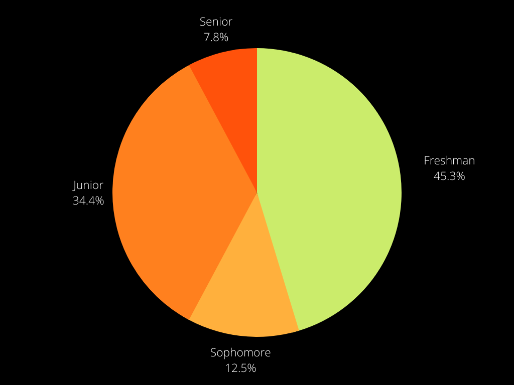
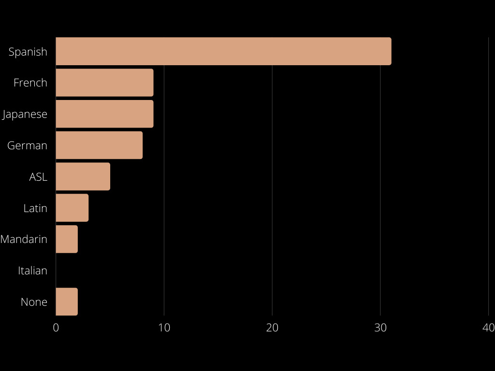
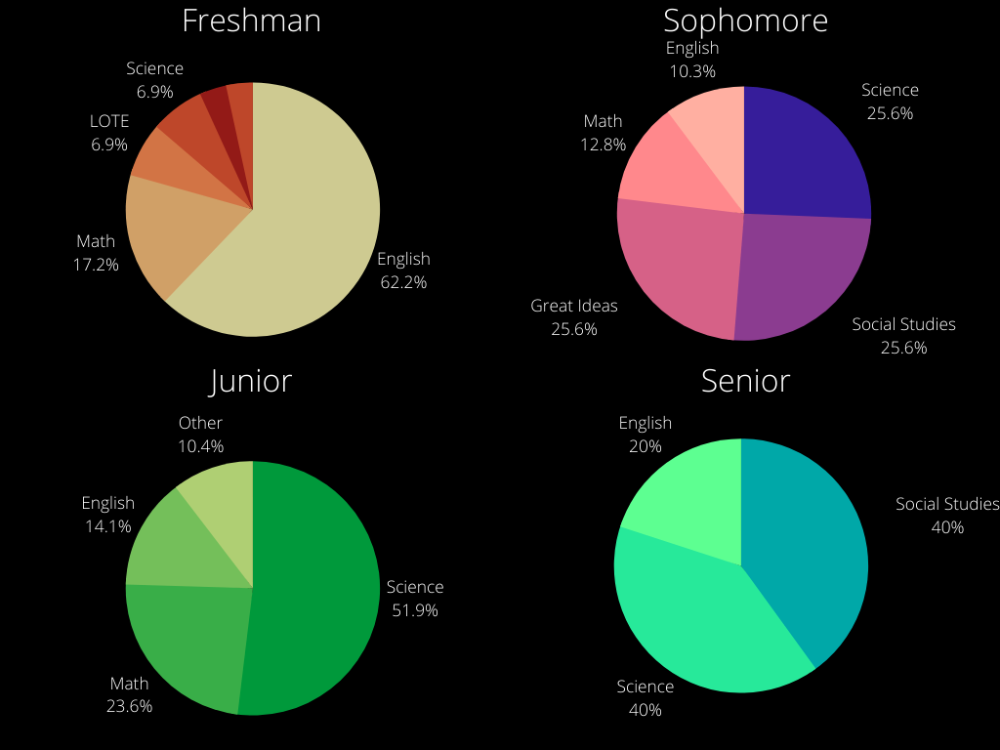

## Introduction

Our first survey ran from November 16th, 2021 to December 1st, 2021 and received a total of 64 responses. We used a combination of Instagram posts and word of mouth to promote the survey, which lead to a skewed distribution of grade levels, shown in the pie chart below:

## Languages

Respondents were asked their opinions on the language they were currently in and sentiment analysis was performed on the responses using NLTK. The model ranks a piece of text from -100% to 100% based on how positive or negative it is; however, our responses only ranged from -63.7% to 89.7%. Most languages had an average score of around 40-50%, but Spanish had an unusually low median of 13.0%, compared to a median of 52.7% for all languages excluding Spanish.

## Homework

A plurality of students spent 1-2 hours on homework each night (39.1%), with a similar number of students spending 0-1 hours and 2-3 hours on homework (26.6% and 23.4% respectively). Roughly 11% of students said they spent 3+ hours on homework each night.

We also asked students which class they thought gave the most homework.

62.1% of freshmen said English gave the most homework, followed by math with 17.2%. For 10th graders, the greatest amount of homework was evenly split between Great Ideas, science, and social studies, with each receiving 25% of respondents. For 11th grade, 50% of respondents noted science as giving the greatest amount of homework. Finally, 12th graders only responded with social studies, English, and science--receiving 40%, 20%, and 40% of respondents respectively.

## Conclusion

Our first survey, although it produced some interesting results, was weakened by its small and specific sample size. In the future, there will hopefully be a more streamlined, wide-reaching process that can produce better, more accurate results.
