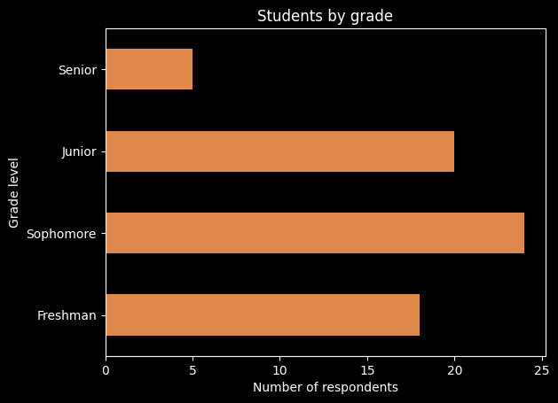
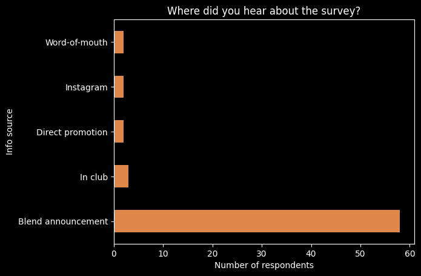
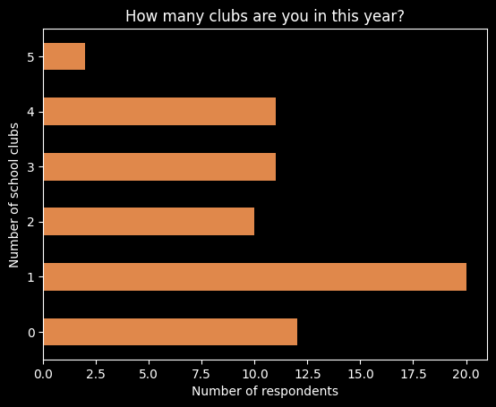
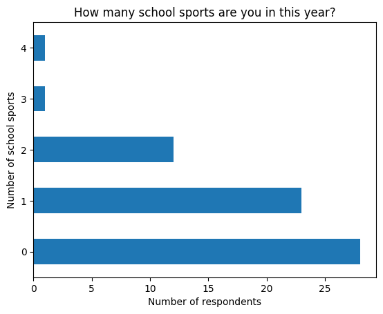
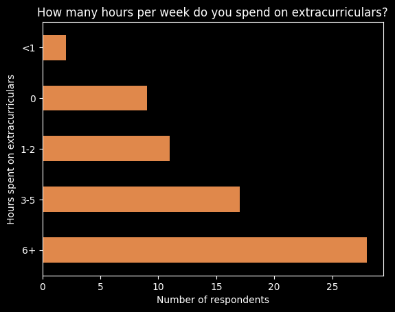
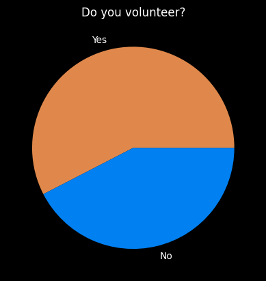
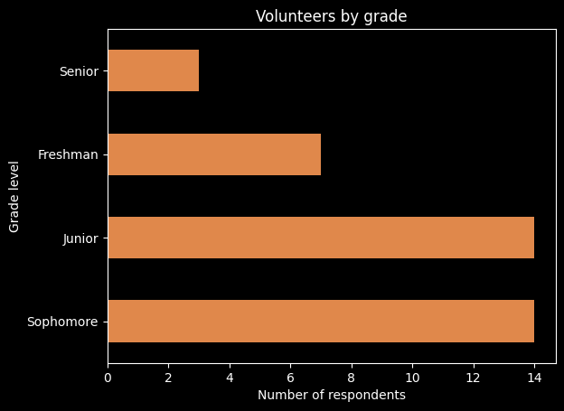
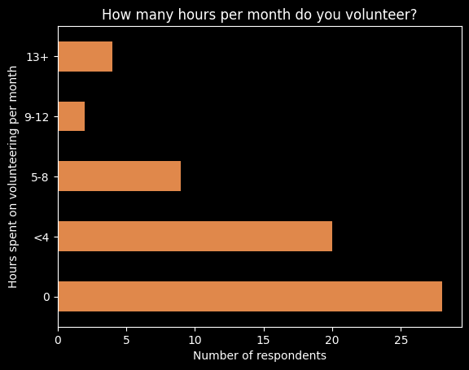
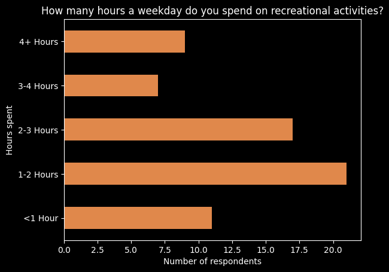

This is an analysis of the LASA Surveyor’s second survey, aimed at
gathering general information about the activities of this year’s
student body. The survey was open from October 30th to November 27th
2023.

## Demographic information

As usual, the least amount of responses came from seniors, while
sophmores responded the most.

By far, the Blend/Canvas announcement was the most successful method of
disseminating the survey. However, posters were not put out for this
survey, which is different from what the Surveyor usually does. All in
all, 67 students responded to the survey.

## Extracurriculars

Most students attend at least one club, with the fewest Number of
respondents answering 5. This makes sense, since clubs usually meet
during lunch, which typically limits a student to four clubs a week.

Over a quarter of LASA students do not participate in any school sport.
Most of those that do stick to one or two.

Over a quarter of students spend over six hours a week on
extracurriculars. A majority of students spend from 0 to 5 hours on
extracurriculars, with less than 5% spending less than one.

Volunteering:

| Yes | No |
| --- | -- |
| 38  | 28 |

A slight majority of students volunteer. The question allowed students
to specify whether they volunteer “only for NHS hours”, but this result
was marked as “Yes” after data gathering since it is ambiguous (how much
of someone’s volunteering has to be for NHS before they select the
option?).

Most LASA students who volunteer are sophmores and juniors, likely
incentivized by college applications.

Irrespective of whether students indicated that they volunteer, all
respondents were then asked how many hours per month they volunteer. Of
those that volunteer, a sizeable portion volunteer less than four hours
a month. To contextualize this, for NHS, members are required to
volunteer 15 hours (or 30 hours, if less than 5 were sponsored) over the
course of 5 months to stay enrolled. This can be distributed to 3 hours
per month.

## Work-Life Balance

