## Background

The LASA Surveyor’s first survey for 2023-2024 was released from October 2nd to 16th and received 95 responses. The survey covered summer activities as well as basic school life.

## Summer Activities

Slightly half of the students traveled out of Texas, and 31% traveled out of the country. Only a small percentage (around 3%) did not leave Austin at all.

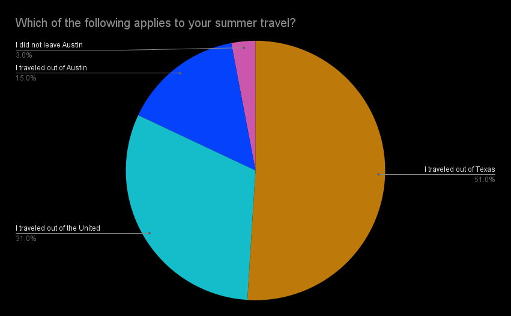

The countries and states which students traveled to can be viewed in the maps below:

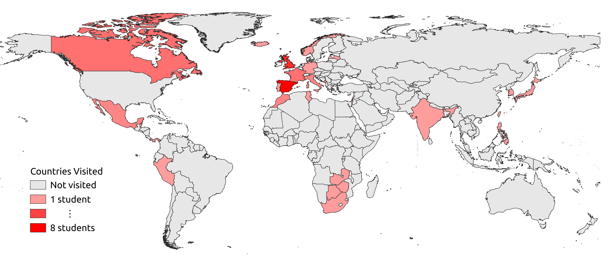

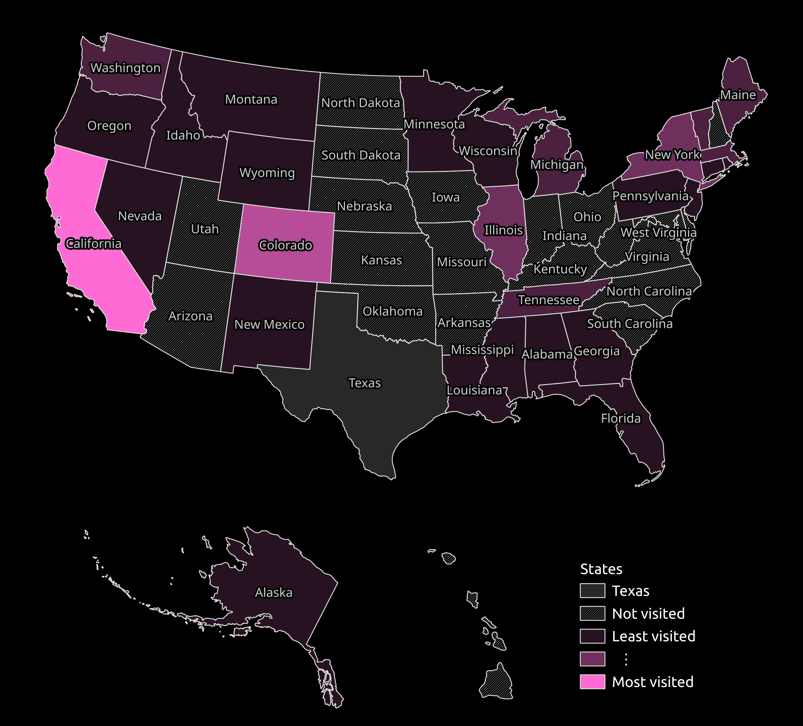

The majority of students traveled for recreation, and half traveled to visit family and friends. Over a quarter traveled specifically for an academic/work-related reason.

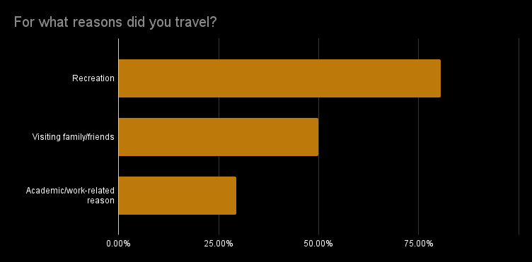

The majority of students (around two-thirds) did not work or intern over the summer.

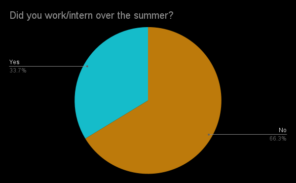

The majority of students also did not take a summer class for highschool or college credit.

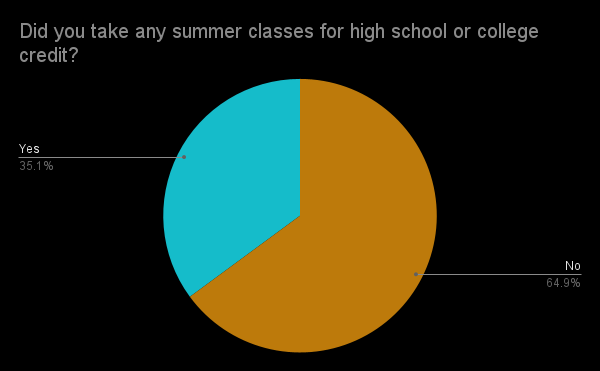

# School

Students were evenly split between the different sports, with the most playing volleyball, followed by track, swim/drive, and cross country. No respondent participated in football, wrestling, or lacrosse (and thus they were omitted from the graph).

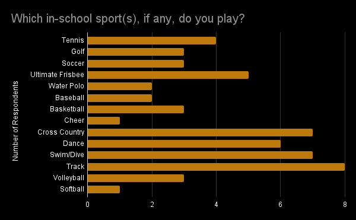

In terms of fine arts, slightly over a third of students were in art, followed by orchestra and band.

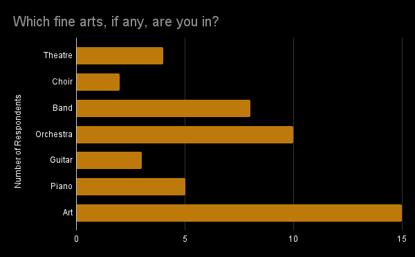

It is important to keep in mind that slightly less than half of the students answered that they participated in a fine art or sport.

Around 44% of students had some sort of preference for A-days, compared with 46% for B-days. The remaining group had no preference.

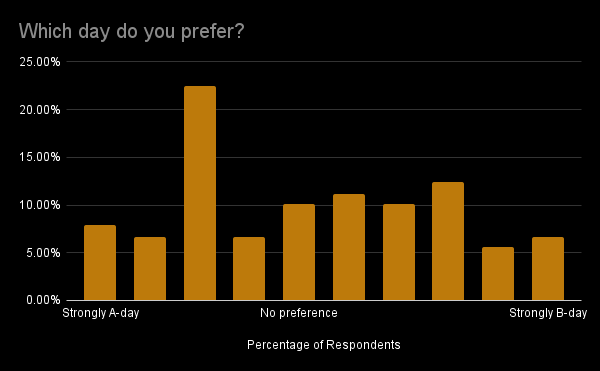

Students were also split among what they thought was the easiest core, although the two pluralities were English and Math respectively.

Over half of the students agreed that science was their hardest core subject, followed by social studies.

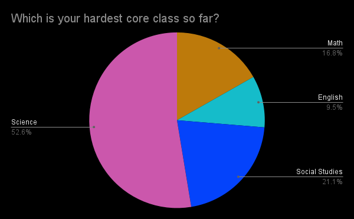

A plurality of students (slightly less than half) spent 1-2 hours on homework, followed by roughly a quarter that spent 2-3 hours.

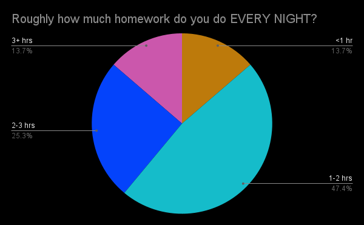
