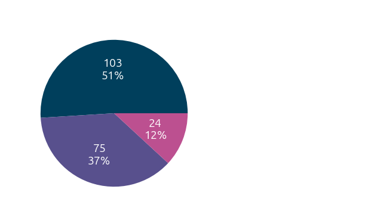
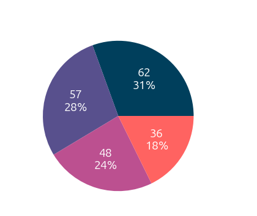
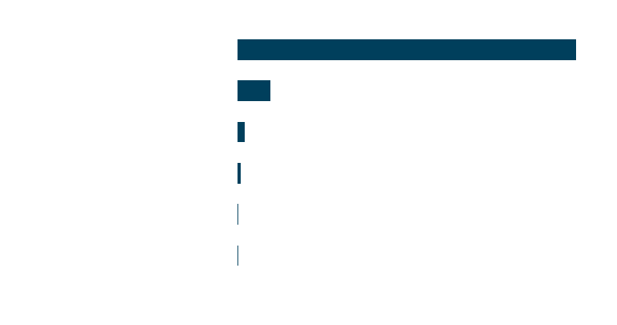
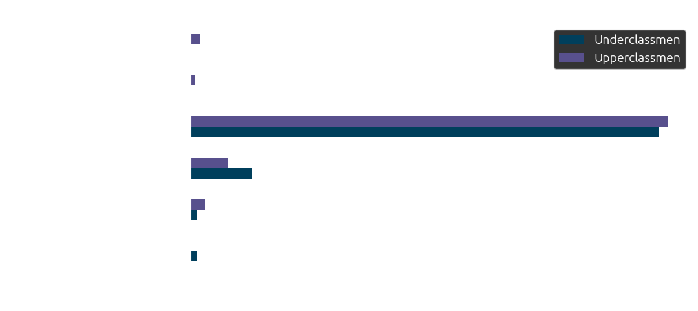
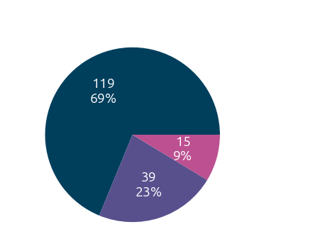
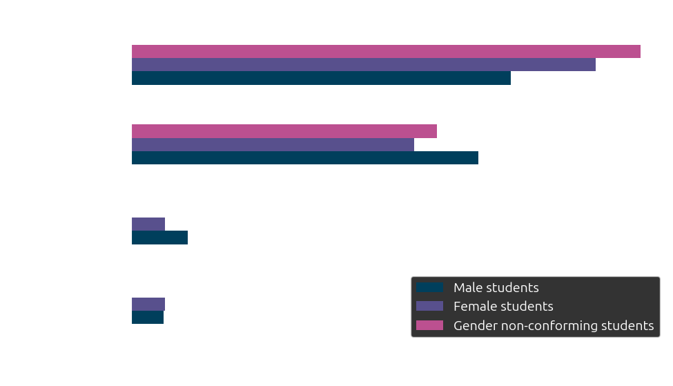
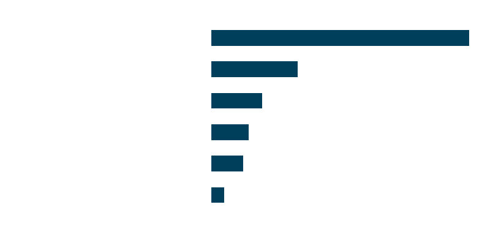

## Introduction

The first survey of 2024, in accordance with the general election that took place this year, was about the candidate preferences and general political views of the LASA student body. Conducted from October 22nd to November 4th, the survey was one of our largest undertakings. 203 people responded to the survey in good faith (responses with at least one non-serious answer were excluded). Around an eighth of the student body participated in the survey, which is the highest rate of response for any Surveyor survey.

Before we discuss our findings, we would like to stress that the results are not necessarily representative of the exact political leanings of the entire student body of LASA. For one, our sample had issues -- as we will show. The bigger caveat is sampling bias: the people who responded were likely to be passionate about politics and politically engaged, meaning that low-information voters were likely underrepresented. As past elections show, such voters are just as important in gaining a complete understanding of the electorate.

Please note that we have included quotes and student opinions. The LASA Surveyor only analyzes and presents the data. Opinions presented were chosen if they were unique or well-written. The LASA Surveyor as an organization does not endorse any political parties, candidates, or opinions.

## Sample

The gender breakdown was as follows: 103 people (51%) identified themselves as male, 75 (37%) identified themselves as female, and 24 (24%) identified themselves as non-binary or otherwise gender non-conforming. This indicates a male-skewed sample, as we believe the "true" ratio to be roughly 45/45/10 based on released Austin ISD statistics and anecdotal evidence.

The breakdown by graduating class was 57 seniors (28%), 62 juniors (31%), 36 sophomores (18%) and 48 freshmen (24%). This skew likely had to do with the fact that all members of the LASA Surveyor are upperclassmen, and our outreach tends to target our peers.

Of the 57 seniors, 17 (30%) were eligible to vote in the 2024 election. Each respondent who was eligible to vote also claimed to be registered. This is an encouraging sign for youth registration and turnout, which has historically lagged behind older generations.

## Candidate Preferences

Responses to this section were entirely voluntary. Respondents could answer or leave blank as many questions as they liked.

Perhaps unsurprisingly, the Democratic ticket for president was the runaway winner among the respondents, with Kamala Harris/Tim Walz gaining 171 (87%) votes. Donald Trump/JD Vance (R) was the second-most popular response, with 17 (9%) votes. Several respondents voted for third-party candidates, with one vote going to Chase Oliver (L) and four to Jill Stein (G). Two people wrote in the Party for Socialism and Liberation’s Claudia de la Cruz and one wrote in independent candidate Cornel West. 

The same trend held for all registered voters, with all but one voting for Harris.

Students were slightly more likely to vote for the Democratic ticket if they identified as female and even more so if they identified as gender non-conforming. Male-identifying people were more likely to vote for Donald Trump. There was no real difference among seniority. Upperclassmen were slightly more likely to vote for the Democratic candidate and less likely to vote for the Republican, but the difference was small.

A similar trend was found in the race for U.S. Senate. 169 people (91%) voted for Democrat Colin Allred, while 14 people (8%) voted for the incumbent Republican Ted Cruz. Two voted for the Libertarian Ted Brown and one wrote in independent Analisa Roche. This trend of Democrats in Senate races outperforming Harris is representative of races across the country, such as in Ohio, Arizona, and other states.

For the U.S. House, we asked respondents to select both the district they lived in and the candidate that they preferred. Most respondents lived in one of the two districts that span the city of Austin, TX-37 and TX-35. 119 people (69%) said they lived in TX-37, a new district created after the 2020 census which roughly comprises everything in Austin west of I-35. The north-south area covered by the district spans from Onion Creek to Tech Ridge, as well as the neighborhoods of Mueller, Cherrywood, and Windsor Park, which are located slightly east of I-35. 39 people (23%) said they lived in District 35, which spans all the way down to the center of San Antonio; the Austin portion is largely made up of communities east of I-35. 15 people (9%) said they lived in another district.

No matter the district, the Democratic candidates were the overwhelming favorite. In TX-37, 112 people (94%) voted for the incumbent Democrat Lloyd Doggett, while in TX-35 33 people (85%) voted for the incumbent Democrat Greg Casar.

The results of the mayoral election were more mixed and received less responses. This trend is likely due party affiliations being omitted on the question as well as several Democratic-affiliated candidates competing on the ballot. A slight majority (77 out of 148, or 52%) voted to give the incumbent Kirk Watson an additional term, with 27 votes (18%) going to former City Council member Kathie Tovo, 18 (12%) going to community organizers Carmen Llanes Pulido and Doug Greco. Eight also voted for business owner Jeffrey Bowen. This exemplifies the strength of incumbency in re-election chances, particularly in races which receive less media attention.

## Policies and Issues

No respondent was required to answer any of the following multiple-choice questions. Each question additionally contained an "unsure" option not included in these plots, as well as an "other" category where people could propose a different answer to the question. At the end of the survey, we asked respondents to select their top issues, as well as a section for them to explain their choices.

### Abortion

The first question we asked was about the legal status of abortion. 104 people (53%) said that the constitution should be amended to protect the right to abortion (with one additional response advocating for a constitutional right to privacy, including abortion). 77 people (39%) advocated for the protections found under Roe v. Wade (the right to abortion during the first trimester) to be reinstated (with one additional response advocating for safe sex and an expansion of sex ed to go along with it). Seven people supported the status quo (leaving the issue up to the states). Ten supported a national abortion ban.

Women and gender non-conforming respondents were more likely to support a constitutional right to abortion than men were.

Reproductive rights were also the most commonly selected "top issue," being a top 3 issue for a majority of respondents. Most respondents who elaborated did so in support, with the stance they shared being accurately summed up by one respondent's decree that "people need to quit bothering women about their choices." Students were also worried about the welfare of people who would get abortions under restrictions, with one student describing living in Texas post-Dobbs as feeling "truly apocalyptic."

> Reproductive rights does not just mean the right to abortion -- though it's a very important aspect -- it means having access to resources that allow a person to decide how, when, and if they decide to have children. Vasectomies, birth control, C-sections, pre-natal care, IVF, hysterectomies, menstruations, miscarriage care, and preventative care are just a few examples of things that fall under the category of reproductive rights.

### College tuition

The next question we asked was about whether college tuition should be free or otherwise subsidized by the federal government. A plurality of students (45%) supported making tuition free at four-year colleges, while 28% wanted to increase federal subsidies to cover tuition. Alternatively, 22% supported making only community college tuition-free. Seven respondents supported the status quo, while one advocated to reduce federal funding for college tuition. One person additionally advocated for colleges to be brought into the state-operated public education system.

We also asked respondents about their thoughts on student loan debt forgiveness. An extremely small plurality (29%!) supported forgiving a portion of debt for all borrowers. 24% supported forgiving debt for all graduates, 21% supported forgiving all debt for a subsection of borrowers (e.g. public service workers, pell grant holders, etc), 17% supported forgiving all student loans, and an additional 10% did not support any kind of student loan forgiveness.

Several respondents also clarified their responses. Among them, one student said that the amount forgiven should depend on several factors including family history, personal circumstances and the amount taken out. Another advocated for gradual forgiveness once the budget deficit decreases. Yet another respondent advocated for forgiveness for all graduates employed full-time for a year.

> We have no logistical way to do this without skyrocketing taxes.

### Healthcare

The next question asked about the role of government in healthcare. A majority of students (59%) believed a universal healthcare system should be implemented, with the option of private insurance, while 32% supported a single-payer system without private insurance in the vein of Medicare for All. Twelve wished for the current system to generally be expanded, but remain for selected groups (e.g. seniors and those with disabilities on Medicare, low-income residents on Medicaid). Three students supported the status quo.

Healthcare was the sixth-most important issue amongst LASA students, with 31% choosing it as a top issue. Elaborations generally stressed the high price of healthcare (including health insurance) in the U.S., with one respondent calling it "ridiculous for a country that prides itself on being an advanced world leader to be struggling with something as simple as affordable healthcare for everyone." One respondent believed that healthcare should be free, as "it's a basic human right," citing that countries with free healthcare "[have] better health outcomes, less poverty, and higher life expectancies."

> Healthcare is more expensive in the US than anywhere else in the world, and it's simply ridiculous for a country that prides itself on being an advanced world leader to be struggling with something as simple as affordable healthcare for everyone.

### Immigration

The next question asked respondents about the topic of immigration. Note that for the first several hours of the survey's release, the question was improperly formatted; students were able to choose multiple answers instead of just one. We moved responses that selected several answers to the "other" section. Overall, this question had a larger amount of "other" responses than normal (around 10%), which is likely a combination of the aforementioned mistake and poorly-designed answer choices.

A slight majority (54%) of respondents wanted to focus more immigration resources towards processing existing cases. 18% supported encouraging more immigration into the U.S., fourteen people supported more resources being devoted to stopping immigration, twelve believed the U.S. should devote less resources overall to immigration, and just five believed immigration to be handled well under the current administration.

Immigration was a largely unpopular choice for a top issue (only 24% selected it in their top 3 issues), but "Other" responses and elaborations on the topic of immigration spanned a wide range of views. Many people believed that immigration at the southern border was a large problem, with responses citing a spike in illegal immigration. One respondent lamented "a record number of illegal immigrants entering the country… The large number of new migrants means that some of them could be dangerous, and even if not, many are not paying taxes, contributing to society, or even had a chance to assimilate to American culture."

> The problem of immigration needs to be addressed, with illegal immigration skyrocketing during the Biden administration.

Alternatively, some responses wanted to expand legal avenues or were more supportive of immigration overall. Several people believed the government should prioritize improving existing systems, such as the work visa renewal system and other legal pathways to citizenship. One response felt "as if America has lost part of it's [sic] purpose," saying that while "Immigration… is a challenge… at the same time, more jobs are being filled, and more work is getting done." Another person criticized the shift in public discourse against immigration, saying that "both primary parties have horrible positions on [immigration]", with Republicans having "borderline genocidal" views of "deporting anyone who is an immigrant" and Democrats "[having] shifted to the right… adopting the Republican position from 2016," citing Harris' non-opposition to a border wall in a recent town hall.

> Surprisingly, immigration can be drastically improved in a few ways, one being improving the work visa system, as most of the illegal immigrants in our country came in legally on work visas but just overstayed their expiration, so if this is renewed or fixed en masse, we would see a huge drop in the illegal immigrant number.

### School vouchers

The next question was about the topic of state-funded "vouchers" for charter and private schools. Perhaps unsurprisingly for a public school, this topic had the most consensus, with a whopping 94% of respondents supporting increased funding of public schools instead of a voucher system. Nine supported the implementation of a voucher system, while one supported the privatization of education altogether.

We did not include an "education" option in our question about key issues, but one respondent did respond with an elaboration of their opinion on this topic in support of public education, citing their belief that "public schools are necessary for every community because they give every child a chance to learn and succeed, no matter their background."

### Military aid

The next several questions focused on foreign policy issues, namely military aid to different countries. Perhaps unsurprisingly, given the issue's perceived complexity (one responded saying that "the whole situation is a big mess"), the topic of aid to Israel was the least responded-to question, with less than 75% of respondents giving an answer. A plurality of respondents (45%) supported eliminating all military aid to Israel, with another 34% supporting a general decrease in the amount of funding given. 17% supported funding at the current rate, and three people supported increasing aid to the country. 

Several responses additionally supported tying funding to Israel on an investigation into human rights violations in the Gaza Strip, as well as increasing humanitarian aid into Gaza. One respondent advocated for sanctioning Israel and "pushing for the formation of a free Palestine through organizing citizens and building power among the working class in the area." Elaborations on this topic were generally critical of United States actions, with one student claiming that "the USA is supporting and funding a genocide in gaza [sic]."

> United States has the power to change almost anything it wants almost anywhere in the world at the push of a button, and between the Bush, Obama, Trump, and Biden administrations, they have all been quite warmongering...

On the other hand, respondents were generally supportive of aiding Ukraine, with a slight plurality (44%) believing that military aid should be increased and 42% believing that we should fund Ukraine at the current rate. Fifteen respondents believed that the U.S. should decrease funding to Ukraine, and eight believed that funding should be eliminated altogether.

One respondent supported sending troops to Ukraine in addition to the military aid already being given. Alternatively, several responses believed that the government should push for peace in the region. One believed that "NATO should interfere" and one believed that the government should take "immediate action" to end the war. Another supported "organizing… the working class" in addition to weapons funding "for a free Ukraine."

### Guns

The next question was on the topic of gun policy. A large majority (78%) supported general strengthening of gun restrictions at the state, local or federal level, with an additional 12% believing that guns should be banned completely. Thirteen supported the status quo, while six believed that gun restrictions should be weakened.

Gun policy was tied for the third most important issue, with 41% of respondents choosing it as one of their top three priorities. "Other" responses and elaborations spanned a wide range of positions on both sides. 

The most common position was to restrict guns more heavily, with many people writing about how anxious they had become as a result of the perceived threat of gun violence, with one person writing "I don't want to go to school and be scared that someone will come [to] kill me or my friends. I don't want to need shooter drills. I don't think that pre-k kids should have to know what guns are and learn what corner of the classroom to hide in." One person recounted a story of being there for a friend in another state who went on lockdown while at school due to one of their peers being shot on campus, and them being scarred while having to watch the aftermath unfold as the victim eventually died.

> As for gun policy, revoking the right to buy guns for the American citizen is impossible -- it infringes on our rights, and sets an incredibly unjust standard of power for the supreme court. The most viable option would be to reduce gun access -- banning automatic rifles (which was never the intention of our second amendment) and to make it harder to purchase firearms.

Various specific policies were suggested to restrict firearms: mandatory background checks, increasing the minimum age to buy weapons, "red flag" laws prohibiting ownership of guns by violent criminals and the mentally ill, and gun licensing and numbering, among others. Several people cited specific statistics, such as the number of school shootings as of the time of writing to make their argument.

> Innocent schoolchildren are dying at the hands of people who should have never gotten their hands on guns.

On the other hand, several people expressed support for the right to bear arms. One person advocated for ambiguous "smart gun laws," while another simply said: "dont [sic] disarm the working class."

> Don't disarm the working class.

### Trans women in sports

The last issue we asked about was in regards to transgender women competing in college sports. This issue had the least consensus amongst respondents, with one noting that the issue is "tough… I know firsthand the gender differences but its [sic] not okay to ban people from competing." A slight plurality (35%) said yes, with testosterone checks. Another 34% said trans women should not be allowed, while another 30% said they should be able to compete with no restrictions. One respondent advocated for the idea of mens' leagues being abolished and replaced with coed leagues, while another believed the decision should be done on a case-by-case basis.

### Top Issues

The top issues overall were reproductive rights, climate change (45%), gun policy, the economy (41%), foreign policy (33%), and healthcare.

On climate change, respondents generally lamented the perceived tossing of the issue to the side in favor of other issues during the campaign, with one student claiming it is being "left behind… in favor of more selfish issues." Elaborations generally tended to focus on how it will negatively affect the world in the long-run. One student pointed out that "future generations will suffer the consequences" if nothing is done to mitigate it. Another student pointed to the inequalities that exist globally between first and third-world countries with regards to the effects of climate change, saying that "we push all our problems to other countries like vietnam, and india, and malaysia… We are all in this together, we are all effected [sic]." 

> Climate change is a very real issue, and there's an incredible amount of evidence to prove it. Continuing to fail to address it to a significant extent **will** lead to more disasters like the recent cyclone season being the 4th most expensive damage wise in the known history of the Atlantic ocean.

The economy was another top issue for respondents. Elaborations on this issue tended to focus on either a broader importance on people's daily life. One person claimed that "the economy is the backbone of all progression as a society." Others focused on continued inflation and increasing cost of living, with one respondent writing: "gas prices are insane, grocery prices are crazy, the whole economy is in shambles." Respondents generally seemed to believe that while things are better than they were several years ago, there is still much room for improvement, whether it be through curbing inflation or solving the housing crisis.

> Economy is at the forefront of everyone's mind; inflation might have been curbed and GDP growth might be back to normal but the cost of living is simply too high for everyone everywhere.

Several respondents also cited other issues as important to them. One person wrote about systemic racism, claiming that it is "institutionalized in America" and "infiltrates every facet of life for people of color in our country," specifically pointing out problems with "the judicial system, the police force, and the education system." They further wrote that Black people were being "kept in lower income neighborhoods and [having] limited access to the same education… policed completely disproportionately and… found guilty much more often… [going] to prison to do years' work for dimes."

> This is a problem with the judicial system, the police force, and the education system, all of which are infiltrated by racism.

Several cited the preservation of democracy as their most important issue, citing Trump's distaste for the democratic process as a whole, with one person calling him an "unconstitutional wannabe fascist" and stressing that a Trump win might mean this election would be the "last time you ever vote." Similarly, one person wrote about their concern about court vacancies, specifically "the Supreme Court's makeup, especially in regard to the executive agencies post-Chevron and… the Jarkesy ruling," warning about undue taxes on an already taxed SEC.

> [Trump] is a convicted felon, sexual abuser, and unconstitutional wannabe fascist who, if elected, will do anything it takes to bring down democracy and this nation as a whole.

A stark political divide emerged between students who were for Trump versus Harris. Both argued that the end of our democratic society would come close if the opposing candidate were to be elected.

> As a Christian first and nationalist second it is the duty of all Christians to vote for candidates who will support Christian values instead of promoting the further deterioration of our society.

## Conclusion

Perhaps the divisiveness and uncertainty seen during the 2024 election may seem insurmountable. One student quoted Theodore Roosevelt in their response: "We Stand at Armageddon, and We Battle for the Lord."

Or maybe things might just get better. Students seem to be split about the future of America, and there is a palpable tension in their responses. However, a common thread between them is a sense of action an hope. Filling out this survey, voting, and caring deeply about issues is the first step to fixing a broken system. Identifying solutions to human issues is the cornerstone of legislative work.

That is why we believe that the flurry of responses to this survey shows LASA students are ready to fight modern-day challenges head-on. At the surveyor, we serve as a barometer for the LASA student population: an indicator of students' thoughts and feelings. We hope you enjoyed this analysis and found it insightful.

Stay tuned for more surveys and analyses. We plan to post interactive features and publish some student survey responses in full.

---

**Disclaimer**: some student quotes have been edited for clarity.

Data analysis by Maxim Rebguns. Blog post by Max Bentley. Edited by the LASA Surveyor Club Captains.
