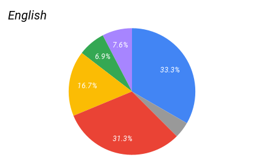
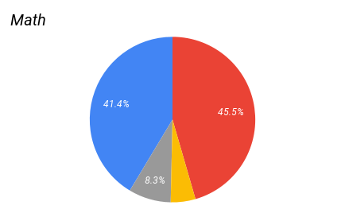
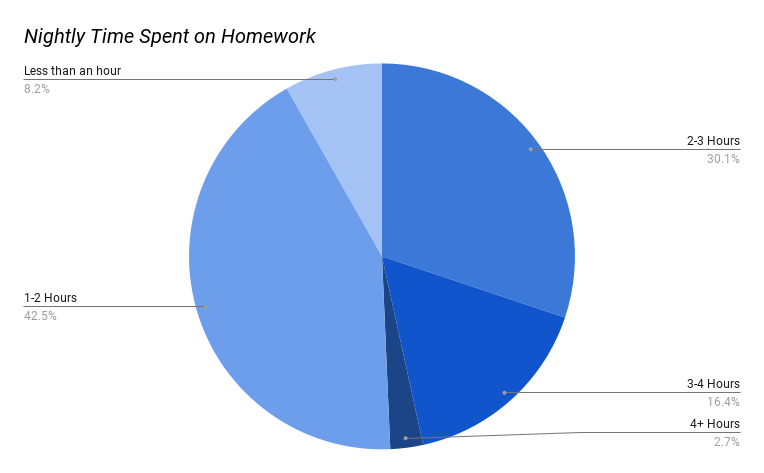

# Background
Our first survey of this year ran from October 10th to October 24th. It covered (generally) school life, with a special section about milk on behalf of the Stetson. It received 147 responses.

# Sample
The responses were skewed towards younger students, with freshmen being the most overrepresented and seniors being the most underrepresented.

| Grade         | Actual % | Recorded % | % pt. Difference |
|---------------|----------|------------|------------------|
| 9             | 30.2%    | 38.8%      | +8.2%            |
| 10            | 27.1%    | 30.6%      | +3.5%            |
| 11            | 20.4%    | 15.6%      | -4.8%            |
| 12            | 22.2%     | 15%        | -7.2%            |

# Subject-Color Association
Social studies voters were by far the most divided, though yellow stood in the lead by a margin of 12 points, followed by orange and purple (Colors represent themselves, gray is other).

English was still contested, mostly between red and blue, though yellow had roughly 1 in 6 votes. Blue leads slightly here, followed by red and yellow.

Math was mostly divided between red and blue, which together made up 86.9% of votes. Red had a slight lead here.

Science was the least contested, with almost 75% of voters selecting green.

# Grades
We also asked what students considered a “good grade” and how satisfied they were with their current grades.

The mean “good grade” was 87.03 (labeled in red), and the median was 90.

The mean grade satisfaction (on a scale from 1-10) was about 6.62.

However, when separated by grade, we see that sophomores have the highest standards for grades (~88.4), followed by seniors (~87.0), then freshmen (~86.4), and finally juniors (~83.4). Seniors are by far the most satisfied with their grades, at 9.33, followed by juniors at 8.48, sophomores at 7.60, and freshmen at 4.11.

| Grade         | Average “good grade” | Average Grade Satisfaction
|---------------|----------------------|----------------------------|
| 9             | 86.22                | 4.11                       |
| 10            | 85.46                | 7.60                       |
| 11            | 89.00                | 8.48                       |
| 12            | 89.40                | 9.33                       |

# Homework
Another topic we asked about was homework. To measure the amount of homework respondents got, we asked them to pick between a few multiple-choice ranges. This is not the most precise, but it is the simplest way of getting this information.

A plurality of students said they get 1-2 hours of homework a night. The next largest portion was those who say they get 2-3 hours, followed by 3-4 hours, then <1 hour.

# Conclusion
Our first survey of the year was limited somewhat by a somewhat small sample size (despite being an improvement from last year) and a skewing towards younger students. However, it still provided some insight into LASA students. In the future, we hope to get our survey out to an even larger audience that is more representative of the LASA student body.